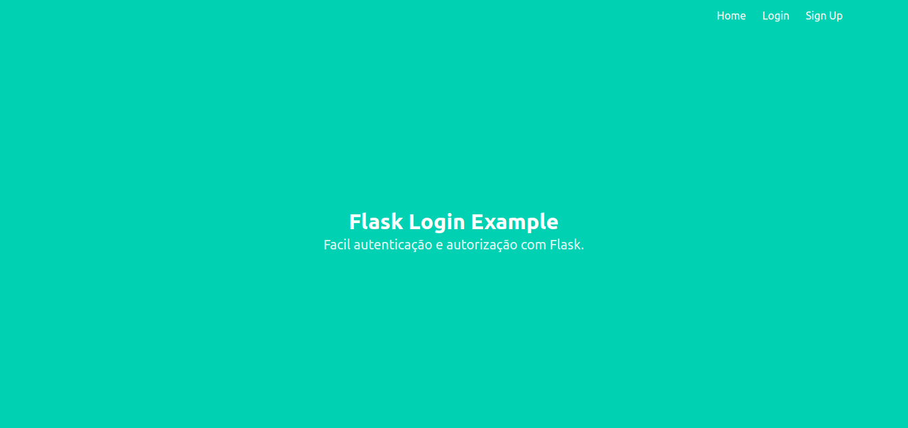
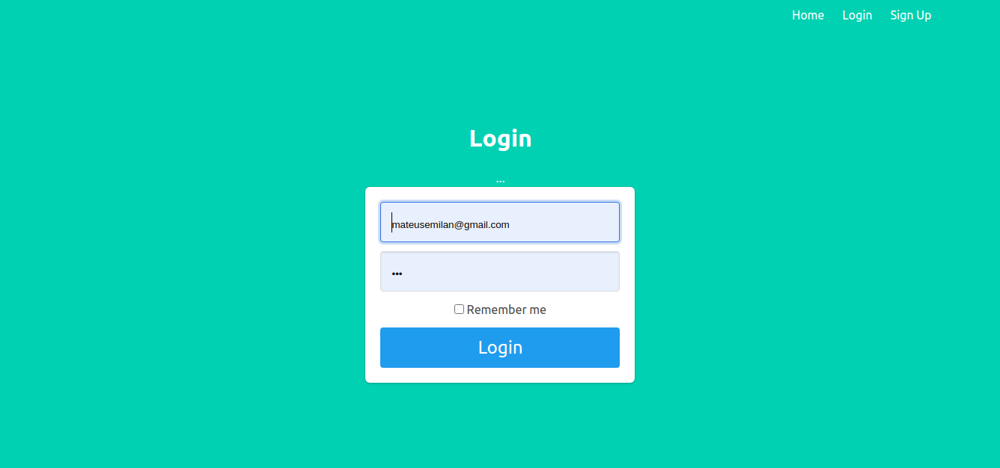
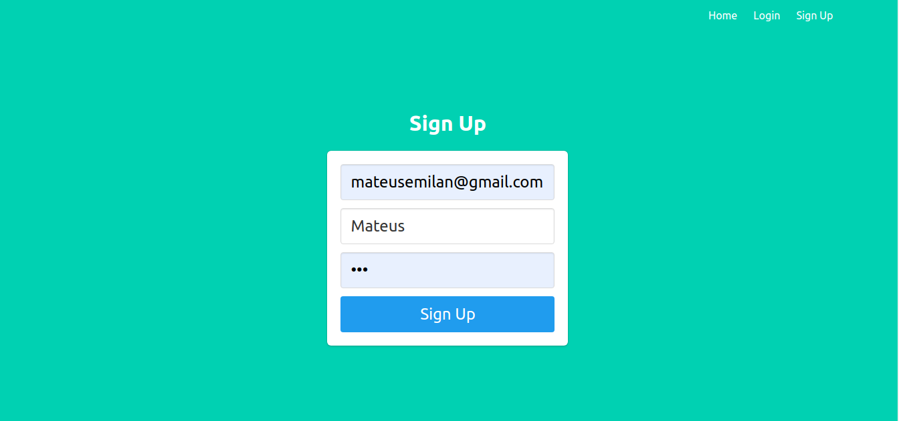

# LOGIN COM FLASK

Este sistema permite que os usuários façam login em uma aplicação, que um recurso muito utilizado nos sistemas web hoje em dia.

## Objetivo

Construir um sistema de login para o nosso aplicativo e abordamos como autenticar um usuário. Primeiro, criamos um modelo de usuário e armazenamos suas informações. Em seguida, foi necessário verificar se a senha do usuário estava correta utilizando o hash na senha do formulário e comparando-a com a armazenada no banco de dados. Por fim, adicionamos a autorização ao nosso aplicativo usando o decorador @login_required em uma página de perfil para que apenas usuários conectados possam ver essa página.
Este programa tem como objetivo ser uma aplicação de conhecimento de estudos na linguagem python, o framework Flask e o banco de dados Sqlite3.

## Tecnologias

`Obs: É necessário ter um ambiente de desenvolvimento Python instalado em sua máquina.`

- [Python 3.8](https://www.python.org/downloads/)

- [VsCode](https://code.visualstudio.com/download)

- [Flask](https://flask.palletsprojects.com/en/1.1.x/installation/https://flask.palletsprojects.com/en/1.1.x/installation/)

- [Flask-Login] pip install flask-login

- [Flask-SQLAlchemy] pip install flask-sqlalchemy

- [Sqlite](https://www.sqlite.org/download.html)

- [Sqlite Browser](https://sqlitebrowser.org/dl/)

## Screenshots

## Licença

Este projeto está sob a licença MIT.

## Autor

Mateus Souza de Jesus, formado em Analise e Desenvolvimento de Sistemas, pelo Centro Universitário Leonardo da Vinci. Estudo a linguagem Python, e também ciência de dados.
